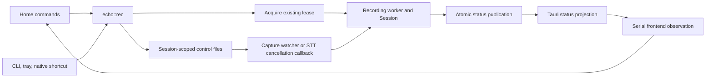

# Recording coordination improvement plan

Status: implementation and automated verification are complete on the recording-coordination branch. Physical-desktop and elapsed routine-use sign-off remain open. See the [implementation record](21-recording-coordination/implementation.md).

Baseline: `55843805aa71a64910daf0730c7921de2fa8afb3`, released as `v0.14.17`.
Investigated on 2026-09-05 using source traces, existing tests, release-verification evidence, Exa, Ref, and three independent architectural critiques.

## Recommendation

Concentrate recording lifecycle decisions inside the existing `echo::rec` module. Reuse `echo_core::Session` and the existing cross-process lease. Make each phase transition and its published observation one owner-scoped operation. Then simplify how commands and the frontend consume that contract.

Start by committing the real CLI verification that caught the last toggle regression. Follow it with a narrow transition/publication change. A permanent daemon, new asynchronous runtime, socket protocol, or wholesale event-driven rewrite is not the starting point.

The desired result is concrete. A maintainer should find the answer to "what can stop this recording?" in one control-policy implementation, and "what phase do observers see?" in one publication implementation. Users should get correct progress, preserved transcripts after an ordinary stop, harmless stale requests, and predictable recovery after an owner exits.

## What the investigation established

| Finding | Evidence at the baseline | Consequence for the plan |
| --- | --- | --- |
| A recording state machine already exists. | [`Session` and its transition tests](https://github.com/ddv1982/echo/blob/55843805aa71a64910daf0730c7921de2fa8afb3/crates/echo-core/src/session.rs#L36) | Extend its ownership discipline. Do not introduce another independent phase machine. |
| The cross-process lease protects several legitimate entry points. | [`ToggleSession::acquire_in`](https://github.com/ddv1982/echo/blob/55843805aa71a64910daf0730c7921de2fa8afb3/crates/echo/src/rec.rs#L810), CLI recording, training, and upgrade takeover | Preserve kernel exclusion, session tokens, and PID/start-tick validation. A desktop-only owner would change supported behavior. |
| In-memory phase and persisted phase can differ during injection. | [`begin_injecting` logs locally, then calls the injector; terminal publication follows History append](https://github.com/ddv1982/echo/blob/55843805aa71a64910daf0730c7921de2fa8afb3/crates/echo/src/rec.rs#L438) | Add a controlled observation test, then make transition/publication inseparable in ordinary execution. This is source-confirmed, not a newly reproduced runtime failure. |
| Control receipts and completion are different things. | [`request_capture_stop_ack` and `request_transcription_cancel_ack`](https://github.com/ddv1982/echo/blob/55843805aa71a64910daf0730c7921de2fa8afb3/crates/echo/src/rec.rs#L251) | A successful stop/cancel receipt confirms an intent write after identity checks. It does not confirm that the worker consumed the request or finished. |
| Frontend guards encode different ordering relationships. | [`useAppController`](https://github.com/ddv1982/echo/blob/55843805aa71a64910daf0730c7921de2fa8afb3/frontend/src/app/useAppController.ts#L74) | Serial polling, a command epoch, session identity, and a session revision cannot be replaced by one generic freshness check. |
| Configuration already has a separate owner. | [`ConfigMutationService`](https://github.com/ddv1982/echo/blob/55843805aa71a64910daf0730c7921de2fa8afb3/src-tauri/src/settings.rs#L76) | Keep configuration FIFO ordering separate from recording, setup progress, and native tray dispatch. |
| Some important checks are outside committed CI coverage. | [`recording_commands.rs`](https://github.com/ddv1982/echo/blob/55843805aa71a64910daf0730c7921de2fa8afb3/crates/echo/tests/recording_commands.rs#L69) exercises explicit library controls; [`cli_rec.rs`](https://github.com/ddv1982/echo/blob/55843805aa71a64910daf0730c7921de2fa8afb3/src-tauri/tests/cli_rec.rs#L9) primarily covers `--once`. The release run separately exercised actual CLI toggles and native Tauri IPC. | Promote the useful temporary checks into maintained tests. Do not equate a successful one-off probe with ongoing CI coverage. |
| Training already has meaningful startup-cancellation tests. | [`runtime_responsiveness_training_start_does_not_block_finish_or_cancel_state`](https://github.com/ddv1982/echo/blob/55843805aa71a64910daf0730c7921de2fa8afb3/src-tauri/src/commands/dictionary_training.rs#L312) | Preserve these tests. Add missing identity/lease cases only when changing that boundary. |

Two distinctions prevent unnecessary work. `rec --once` already carries a token and revision through `StopWhen::Timer(Some(session))`. Native portal/X11 callbacks execute inside Echo; a separately launched CLI creates the important separate-process case.

The recent bugs cluster around boundaries rather than the pure transition table: a reply reread a replacement session, legacy intent cleanup differed during training, queued setup activation ignored a later cancellation, and a toggle inferred cancellation after writing capture-stop. The repairs are in [PR #135](https://github.com/ddv1982/echo/pull/135), [PR #136](https://github.com/ddv1982/echo/pull/136), and [PR #137](https://github.com/ddv1982/echo/pull/137). The next plan should test these boundaries directly.

## Current ownership and flow

The owner is whichever Echo process acquires the recording lease. It can be the desktop process or a standalone CLI process. That owner performs capture, transcription, injection, History persistence, and status publication.

`recording.gate` supplies kernel-backed exclusion. `recording.lock` identifies the owner and carries its token and process identity. Scoped stop/cancel files let another process request control while the owner is occupied with blocking audio or transcription work. The atomic status file is an observation of that owner, not a substitute for the lease.

Training shares the lease but has a separate capture-startup protocol. Configuration uses its own FIFO worker. Neither belongs inside a universal recording queue.

The distinction matters for any proposed actor or inbox. The current worker blocks in capture and transcription. Putting Stop behind either call in one command queue would make it unresponsive. An alternative must retain the current control path or introduce and justify a separate responsive control task.

## Alternatives and decision

| Approach | What it can improve | Cost and limits | Decision |
| --- | --- | --- | --- |
| Consolidate transitions, publication, and control policy inside `echo::rec` | Reduces the places that must agree on phase, token, and receipt behavior | Keeps file-based communication; requires careful call-site migration | Recommended near-term work |
| Add a desktop status read model with optional push delivery | Could reduce repeated projection work and frontend observation logic | Still needs external CLI reconciliation, reconnect behavior, and ordering across reads and notifications | Measure and consider later |
| Add a per-session local socket endpoint | Could provide explicit request/reply delivery to the current owner | Adds endpoint discovery, protocol versioning, bounded requests, peer validation, shutdown, and compatibility behavior | Bounded experiment only if a remaining problem justifies it |
| Require a permanent desktop broker or daemon | Could centralize all command routing | Changes standalone CLI behavior and adds startup, failure, upgrade, and service-lifetime contracts | Not recommended for this plan |
| Split large files or add another public facade first | Makes navigation different | Does not remove decisions; `echo::rec` is already a public boundary | Do only after responsibilities change, where the move has a clear owner |

[Tauri channels provide ordered streaming](https://tauri.app/develop/calling-frontend/#channels). They do not by themselves establish replay, external CLI observation, or command completion. [Tokio documents resource ownership through message passing](https://tokio.rs/tokio/tutorial/channels), but that pattern does not require converting Echo's existing standard-thread recording code to Tokio.

[Linux flock semantics](https://man7.org/linux/man-pages/man2/flock.2.html) explain why an open descriptor matters for lease lifetime, including inherited descriptors. [Unix socket documentation](https://man7.org/linux/man-pages/man7/unix.7.html) supplies mechanisms for local communication and peer credentials, not an application-level lifecycle or retry contract. These are constraints on an experiment, not reasons to replace the current transport.

## Phased delivery

The effort ranges are planning estimates for one developer familiar with this code. They include targeted verification, but exclude hosted CI waits and unavailable desktop environments. Re-estimate after Phase 1. Each phase can stop without committing the project to the later experiments.

| Phase | Outcome | Indicative effort | Exit gate |
| --- | --- | --- | --- |
| 1. Preserve the important proofs | Maintained public-path tests and a current baseline | 1 to 3 engineer-days | Stop/save, intentional cancel, stale-owner safety, and controlled recovery have explicit evidence |
| 2. Make phase publication owner-scoped | One transition/publication implementation around the existing state machine | 3 to 5 engineer-days | Every published active phase corresponds to owner state; no duplicate phase authority |
| 3. Clarify controls and frontend observation | One control policy and one frontend recording-observation implementation | 3 to 5 engineer-days | Existing ordering guarantees survive; production policy/state has an explicit deletion list |
| 4. Prove recovery and everyday behavior | Small native test lanes, useful local diagnostics, and documented recovery limits | 2 to 4 engineer-days plus 1 to 2 weeks of routine use | No unresolved severe session, transcript, or recovery failures in the exercised lanes |
| 5. Decide whether transport changes earn their cost | A measured decision to retain files/polling or pursue one bounded replacement | Optional 2 to 3 engineer-day experiment | Benefit and deletions demonstrated; otherwise retain the simpler system |

### Phase 1: preserve the important proofs

The first PR should add actual CLI toggle cases to `src-tauri/tests/cli_rec.rs`, using its built binary rather than a hard-coded `target/debug` executable. Reuse the fixture and blocked fake-engine technique from `crates/echo/tests/recording_commands.rs`. Share setup only where both tests need it.

Required first cases:

1. Start capture with `rec --toggle`. Stop it with a second toggle. Hold transcription at a controlled boundary, verify that no cancel was requested, release it, and assert one expected History row.
2. Start another session. Stop capture, wait for the engine-ready boundary, then issue a separate toggle during transcription. Assert cancellation and no successful History row.
3. Start again after both outcomes to prove lease release and continued usability.

Use explicit readiness signals and bounded waits. Do not depend on sleeping long enough to hit a race. Keep the existing order-sensitive unit regression from #137; it provides a controlled ordering check, while these process tests prove the actual CLI route and result.

In the next small test unit, exercise an old token after replacement and kill an owner during fixture capture or blocked transcription. Assert that the replacement is the sole live owner, ignores old intents, and can complete its own run. A delayed reply test must distinguish a request rejected as stale from an old accepted receipt delivered late; neither may change the replacement's UI state.

Record the current behavior at the injection boundary. A blocked injection operation should let the test compare the in-memory transition with the externally observed phase. Treat the existing missing `Injecting` publication as a focused behavior change in Phase 2, not as an excuse to replace the whole runtime.

Produce a small baseline record with source commit, binary identity, command, test environment, case outcomes, and observed command-to-phase delays. Use the same workload after each change. No current failure-rate or latency baseline has been measured by this research task.

Stop if an existing severe failure reproduces. Fix it in a focused unit before refactoring the affected boundary. Do not paper over it with longer sleeps or extra frontend guards.

### Phase 2: make phase publication owner-scoped

Make the existing session owner responsible for applying a `Session` transition and publishing its observation together in normal execution. Keep `Session` as the pure transition model. Compose it with the held lease rather than storing another independent phase field.

The change should remove repeated transition-plus-status-write sequences inside `run_record_with_limit`. Publish `Injecting` before calling the injector. Preserve the rule that a History ID is exposed only after its append succeeds. Handle configuration/startup failures explicitly, since those can happen before ordinary recording begins.

Define what a failed status publication means. A successful in-memory transition cannot be made crash-atomic with a file write merely by wrapping both in a method. A publication failure must reach a deliberate failure/reporting path, and readers must still be able to recover after the process exits. Do not report a completed phase change solely because a helper returned the new enum value.

Keep public payloads, lease acquisition, control-file formats, and compatibility behavior unchanged in the first unit. Restrict or migrate direct status writers only after identifying all production callers. Test-only fixtures are not production authorities.

Exit evidence:

- Blocked capture, transcription, and injection expose the corresponding phase for the same session.
- Failure and success paths retain correct session identity and History IDs.
- Owner publications advance monotonically within a session.
- Startup failure, owner death, and failed publication do not leave an unrecoverable lease.
- The diff deletes the old transition/publication duplication. A new wrapper around unchanged scattered calls does not satisfy this phase.

### Phase 3: clarify controls and frontend observation

Write down the existing contracts before changing their representation:

- Start returns after the owner publishes its initial recording state.
- Stop and cancel return after a matching intent has been written, subject to the current observed-phase checks. This is not confirmation that the worker consumed the intent.
- A late control or receipt must never become authority over a replacement session.
- Duplicate capture-stop cannot become transcription-cancel.
- Intent revision and owner-publication revision have different meanings. Today's receipt uses `r + 1`; owner publication advances by two. Comparison is meaningful only within the same non-null session.

Name these distinctions in the internal types and concentrate the revision/receipt construction rules. Keep the current numerical wire contract until an alternative has equivalent tests. Opaque session tokens must remain opaque; a type wrapper is not a reason to require UUID-formatted legacy tokens.

Keep Home's explicit commands and the legacy toggle affordance distinct at the boundary. Both should call one tested recording-control policy. Toggle must choose its interpretation from the pre-stop observation and bind cancellation to the matching token. A generic `toggle` command should not return to Home.

Consolidate recording observation inside the existing app controller or one feature-specific helper. Add a helper only if it removes state or decisions from the controller. Do not add a new global store by default.

| Existing protection | Proof needed before changing or deleting it |
| --- | --- |
| Serial polling | One active observation request; no post-disposal update; explicit convergence after visibility returns |
| Command epoch | A poll started before a command cannot overwrite its accepted result |
| Session-bound reply guard | A late reply for session A cannot replace an already observed session B |
| Same-session revision check | Delayed status cannot regress progress or clear an accepted stop indication |
| Recovery reads | Missing an event or reconnecting still converges after external CLI activity |

Configuration snapshot revisions, setup operation IDs, microphone-test lifetimes, and tray request ordering stay in their current domains. UI busy counts are not automatically redundant ordering mechanisms. Preserve them unless the affected behavior has a replacement.

Exit evidence includes delayed/reordered reads and replies through the real production Tauri adapter, plus the existing React regressions. The preview implementation must preserve the same command semantics, but a preview-only test cannot certify native IPC behavior.

### Phase 4: prove recovery and everyday behavior

Maintain a small set of distinct verification lanes:

| Lane | What it proves | Scope |
| --- | --- | --- |
| Linux CI with fixture audio and a gated fake engine | Actual CLI controls, owner replacement/death, History outcomes | Required automated coordination checks |
| Real Tauri/WebKit under an isolated virtual display | Command serialization, receipts, observation convergence, settings ordering | One maintained native smoke test; no real microphone required |
| A real supported desktop used for routine dictation | Shortcut activation, target focus, insertion, microphone behavior, and practical recovery | Record the actual backend/environment; evidence applies to that lane |
| The other shortcut/injection family before changing its behavior | Portal/Wayland or X11-specific regressions | Focused verification, not an exhaustive compositor/model/device cross-product |

Preserve training's existing blocked-start cancellation test. If shared lease/control code changes, add only the missing duplicate-start, wrong-ID, active finish/cancel, and dictation/training collision cases. Do not force training's startup protocol into the dictation phase machine.

Reproduce crashes at controlled capture and transcription boundaries. Test deferred upgrade takeover and eventual replacement only where that lifecycle is affected. Recovery must permit another recording, reject old controls, and avoid automatic reinjection.

Document the persistence guarantee honestly. History is currently appended after injection. Ordinary injection failure can still preserve a transcript, but a process crash before append is not guaranteed to recover that text. A pre-injection journal is a separate product and storage decision with retention and duplicate-insertion consequences. Raw audio retention is outside this plan.

Use a bounded, local diagnostic record only if existing evidence cannot explain failures. Prefer synthetic run IDs, phase/revision transitions, command kinds, error categories, and durations. Exclude transcript text, raw audio, clipboard content, full status files, and personal device names. Remote telemetry is not part of this proposal.

Track scenario outcomes and latency distributions against Phase 1, along with environment and sample counts. Zero failures in a small run is evidence for that run, not a reliability percentage. Any wrong-session action, transcript loss after an ordinary completed stop, duplicate injection, or unrecoverable recording state blocks release of the changed path.

### Phase 5: decide whether transport changes earn their cost

Only enter this phase if the earlier work leaves a measured problem: material control delay, repeated state reconstruction, or ordering rules that still cannot be localized.

For a status read-model experiment, compare the retained serial poll with one desktop-owned snapshot projection and optional push notifications. Define ordering between subscription, initial read, command receipt, external writer changes, and reconnect before implementation. A latest-value stream is not a durable history of completed runs. Preserve History refresh semantics even if intermediate recording phases are missed.

For a local endpoint experiment, keep the lease as exclusion authority. Specify a versioned request, target session, bounded size, deadline, response semantics, and endpoint lifetime. Control must remain responsive while capture/transcription blocks. Test disconnects, old binaries, owner replacement, and shutdown before removing any file-based control path.

Compare candidates using the same baseline. Count production policy implementations, mutable coordination fields, separate lifetimes, and required recovery branches. Require an explicit list of code and state that the candidate removes. Faster delivery alone does not justify a much larger protocol unless it addresses a demonstrated user problem.

Do not retain files, sockets, polling, and events indefinitely as equally authoritative parallel paths. Any migration bridge must have an owner, supported-version policy, tests, and a removal gate. If the experiment does not show a worthwhile improvement, keep the consolidated file protocol and polling and stop here.

## Measures of improvement

Use these as acceptance criteria, not a promised percentage reduction:

- One pure dictation transition model and one production transition/publication policy.
- One interpretation of explicit control and one explicit mapping of legacy toggle gestures.
- One frontend implementation of recording observation ordering.
- Fewer production call sites that independently interpret phase/token/revision combinations, recorded before and after.
- No weakening of the public-path, stale-owner, compatibility, persistence, or recovery tests.
- No new always-on process or runtime dependency in Phases 1 through 4.
- A maintainer can locate the control policy and publication rule without tracing unrelated settings/setup code.

Large-file counts are navigation aids only. At this baseline `rec.rs` has 1,862 lines, including its main test module starting at line 1,164. The 1,609-line desktop `status.rs` includes its main test module from line 797. Splitting either file does not by itself satisfy these criteria.

## Relationship to earlier plans and delivery rules

[Plan 19](19-status-latency/overview.md) already proposes a status service and event-first delivery. Its [baseline evidence](19-status-latency/evidence/README.md) was collected at an older commit and found presentation work dominated transport cost. Current code still uses serial frontend polling. Reuse that measurement method and reassess the event-first proposal in Phase 5; do not treat an older planned phase as an implemented guarantee or a current benchmark.

Deliver each test, behavior fix, and consolidation as a reviewable unit. Avoid a large stack whose later changes obscure which transition broke. Record the tested commit and binary identity. Use a separate Cargo target for deliberately mutated/reversed-order test builds; a lock alone does not prevent stale artifacts from different checkouts being reused.

Keep protocol compatibility until a documented release policy says which installed CLI/shortcut versions may be retired. Legacy flat intents and PID-only fallbacks have real mixed-version consumers. Neither is dead code merely because the current desktop writes the newer format.

For a regression, revert the narrow unit or prepare a forward fix on `main`. Do not automatically restore old user data or replay an uncertain injection. Releases continue to require green merged-main checks, verified packages, an immutable version tag, and notes describing user-visible behavior.

## Research judgment and remaining uncertainty

The critiques rejected another public facade, another phase machine, a universal queue/revision, and a default permanent daemon. They supported owner-scoped transition publication, public-path regression coverage, explicit receipt semantics, and conditional transport experiments. Those are the decisions adopted here.

[Loom](https://github.com/tokio-rs/loom) and [Shuttle](https://github.com/awslabs/shuttle) can explore instrumented concurrent schedules. They are optional tools for a small in-memory controller after it exists. They do not replace real process/file tests, native IPC checks, or desktop usage. If an external React snapshot store becomes justified, [React's subscription contract](https://react.dev/reference/react/useSyncExternalStore) requires stable snapshot identity and correct cleanup; introducing that store is not itself a simplification goal.

This investigation establishes source structure and coverage boundaries. It does not establish a current real-world failure rate, performance improvement, or exhaustive compositor support. The source-confirmed publication gap still needs its controlled runtime test. Durability before History append and the legacy support window remain explicit decisions for the relevant later phase.

Poteto's Model the Domain principle keeps the existing `Session` as the phase model. Minimize Reader Load makes deletion of duplicated policy the acceptance criterion. Sequence Work into Verifiable Units puts public-path proof before restructuring. Laziness Protocol makes transport replacement conditional rather than mandatory.
