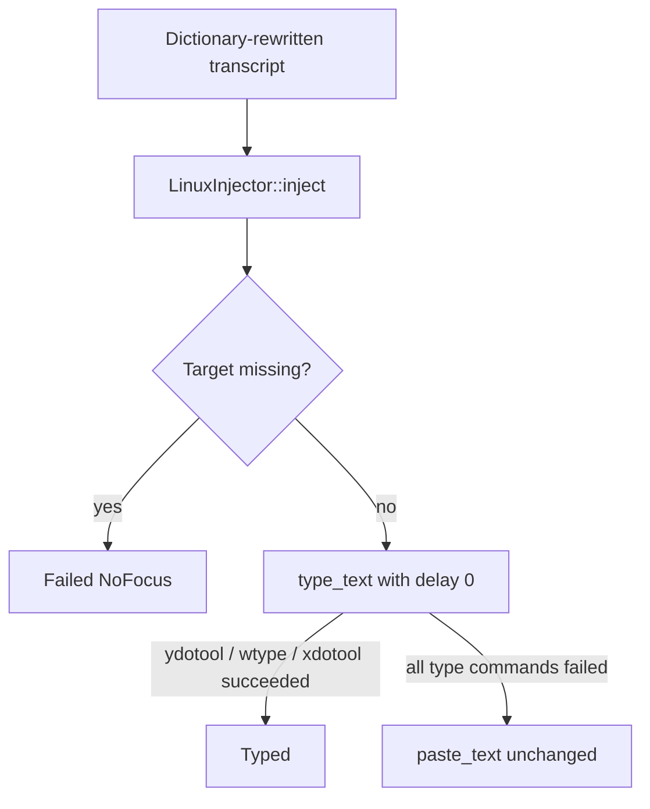

# Instant text insertion plan

Status: research complete; not implemented. Intent clarified 2026-09-07: remove the slow per-character delay, not switch to clipboard paste.

This is a command-flag change in the existing type path. Type stays primary. Paste stays the fallback.

## User-visible problem

After transcription, the transcript appears in the focused app one character at a time. That looks like a typing animation. Fine for a sentence; too slow for a long story.

This is not a frontend animation. Home only shows `Inserting transcript…` during `Injecting`. The delay is simulated keystrokes.

Cause: Echo calls `ydotool type`, `wtype`, and `xdotool type` without a delay flag. Those tools default to **12 ms per key**. 2,000 characters ≈ 24 s.

## What stays unchanged

[`LinuxInjector::inject`](../../crates/echo/src/inject.rs) still types first, then pastes only if every type backend fails. Clipboard-free typing, focus pinning, paste restore, `InjectReport` wire shapes, Settings, and `rec.rs` stay as they are.

## Alternatives and decision

| Approach | What it does | Decision |
| --- | --- | --- |
| Pass delay 0 on every type command | Removes the 12 ms/key sleep. Text still arrives as key events, but a long story should land in a fraction of a second instead of tens of seconds. Clipboard-free. Terminals keep working. | Recommended |
| Prefer clipboard paste | Instant blob, but overwrites clipboard, breaks many terminals, and risks duplicate insertion if type still runs after `ctrl+v` | Not this request |
| Type/Paste setting or length heuristic | Extra product surface for a delay bug | Reject |

Honest limit: delay 0 is still sequential key events. Editors may still fire per-character autocomplete. If a later story is still too slow, clipboard paste is the next lever — not the first.

## What to change

One file for behavior, plus exact-argv tests and a short changelog line.

| Call | Current argv | New argv |
| --- | --- | --- |
| xdotool | `type --clearmodifiers [--window id] -- TEXT` | insert `--delay 0` after `--clearmodifiers` |
| ydotool | `type --file -` with stdin | `type --key-delay 0 --file -` |
| wtype | `-- TEXT` | `-d 0 -- TEXT` |

`run_xdotool_type` is the single xdotool type helper, including targeted X11. Change it there.

Confirm flag spelling against the installed binaries during implementation:

- ydotool already uses `--file`; Ubuntu/Arch document `--key-delay`
- wtype `-d` is milliseconds; if the binary rejects it, leave wtype argv unchanged

## Tests

Existing adapter tests pin exact argv. Update those strings; do not add paste-order cases.

- `wayland_typing_tries_each_backend_once_with_exact_ydotool_stdin`
- `x11_typing_tries_each_backend_once_in_order`
- `unknown_typing_uses_x11_order`
- `captured_x11_typing_focuses_and_types_once_without_clipboard`
- `submitted_but_unconfirmed_targeted_paste_reports_failure` (includes a type argv)

Keep the type-first / clipboard-untouched proofs. Keep [`inject_linux.rs`](../../crates/echo/tests/inject_linux.rs).

No frontend tests. No recording-coordination changes. Architecture and troubleshooting can stay: they already describe type-then-paste.

Changelog: transcripts are typed with no inter-key delay, so long dictation no longer trickles in.

## Verification

- `cargo test -p echo inject`
- `cargo test -p echo --test inject_linux` when `DISPLAY` is usable
- Dictate a long paragraph into the usual editor: should appear quickly, not as a slow animation. Clipboard should be untouched on the typed path.

## Out of scope

- Reordering type vs paste
- New insertion backends or a Settings preference
- Focus capture, HUD, `Injecting` publication
- Terminal-specific paste chords
