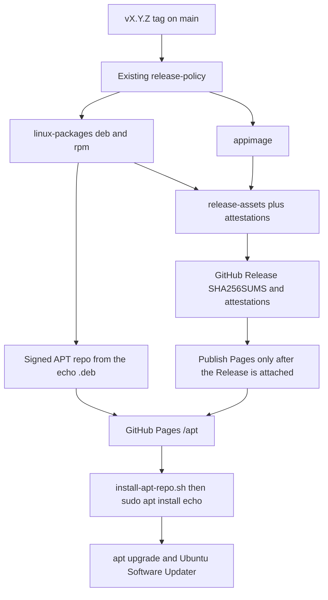

# APT and Ubuntu Software update plan

Status: implemented; first cutover is v1.0.0. Operator still needs GPG secrets and Pages source = GitHub Actions before a tag publish.

Investigated 2026-09-07 against `csv-data-anonymizer` release CI, that project's
README Download section, Echo's current tag release, Tauri 2 bundle config,
AppStream desktop-application metadata, and GitHub Pages Actions deploys.

## User-visible problem

Echo installs only as a one-shot GitHub Release download:

```sh
sudo apt install ./FILE.deb
```

There is no signed APT source, so `sudo apt update` / Ubuntu Software Updater never
offer a newer Echo. The Debian/RPM name is `io.github.ddv1982.echo`, so the GitHub
owner sits in front of the app name on disk and in `dpkg -l`.

CSV Anonymizer already has the missing channel: a signed GitHub Pages APT repo, a
bootstrap `.deb`, and `sudo apt install csv-anonymizer`. Echo should get the same
install/update path without weakening tag provenance, attestations, or the portal
app id.

## Recommendation

Keep GitHub Releases as the verified download. Add a tag-only signed APT repository
on GitHub Pages, the same shape as CSV Anonymizer. Rename the Debian/RPM package to
`echo`. Do not rename the binary, identifier, or desktop file.

Do not copy the anonymizer Node scripts. Echo's release tooling is Python; port the
Python APT builder and rewrite the Node checks in Python.



## What the investigation established

| Finding | Evidence | Consequence |
| --- | --- | --- |
| Anonymizer README is the user-facing install template | [`csv-data-anonymizer/README.md`](../../../csv-data-anonymizer/README.md) Download/Linux: format list, curl bootstrap, `apt update`, `apt install <app-slug>`, note that direct downloads are checksummed | Echo README Install must be rewritten to that shape, with package `echo`. Do not leave `sudo apt install ./FILE.deb` as the primary path |
| Anonymizer package name is the app slug, not the GitHub id | `productName` Linux overlay `csv-anonymizer`; identifier stays `io.github.ddv1982.csv-data-anonymizer` | Echo package becomes `echo`; identifier stays reverse-DNS |
| Tauri has no Debian `packageName` field | [DebConfig](https://tauri.app/reference/config/#debconfig): depends, files, desktopTemplate, conflicts, provides, replaces — no name override | Package name today is `productName`. Changing `productName` also renames the `.desktop` file |
| Echo tied `productName` to the identifier on purpose | [`packaged_desktop_basename_matches_the_portal_app_id`](../../src-tauri/tests/desktop_entry.rs), `APP_ID = io.github.ddv1982.echo`, `DESKTOP_ENTRY=io.github.ddv1982.echo.desktop` | GlobalShortcuts needs `io.github.ddv1982.echo.desktop`. Do not make the desktop file `echo.desktop` |
| Echo already publishes `.deb` / `.rpm` / AppImage with attestations | [`.github/workflows/release.yml`](../../.github/workflows/release.yml), [`docs/RELEASING.md`](../RELEASING.md) | APT is additive. Do not replace SHA256SUMS or attestations with GPG on GitHub assets |
| Anonymizer APT is rebuilt from the current tag's `.deb` only | `scripts/build_apt_repository.py` + Pages artifact `dist/rust/apt-pages` | Latest-only pool. `apt upgrade` works; old versions are not kept on Pages |
| Ubuntu Software Updater follows APT | Signed `InRelease` / `Release.gpg` plus a `deb822` source with `Signed-By` | Enough for `apt update` and update-manager |
| GNOME Software / Ubuntu Software needs AppStream | [AppStream desktop-application](https://www.freedesktop.org/software/appstream/docs/sect-Metadata-Application.html): reverse-DNS `<id/>`, required `<launchable type="desktop-id">`, DEP-11 catalog in the repo | Ship metainfo in the `.deb` and generate DEP-11 in the APT builder, as anonymizer does |
| Debian archive has no binary package named `echo` | `python3-echo`, `golang-github-labstack-echo-dev`, etc. — not `echo`. `/usr/bin/echo` is `coreutils` | Package `echo` is free. Binary must stay `echo-desktop` |
| GitHub Pages from Actions is the host | [deploy-pages requirements](https://docs.github.com/en/pages/getting-started-with-github-pages/using-custom-workflows-with-github-pages): `pages: write`, `id-token: write`, `github-pages` environment | Same wiring as anonymizer. Operator must set Pages source to GitHub Actions |

## Identity

Visible name is already `Name=Echo`. The GitHub string belongs only in the unique id.

| Role | Current | Target |
| --- | --- | --- |
| Visible name | Echo | Echo |
| Debian/RPM package | `io.github.ddv1982.echo` | `echo` |
| Artifact names | `io.github.ddv1982.echo_0.14.24_amd64.deb` | `echo_0.14.24_amd64.deb`, `echo-0.14.24-1.x86_64.rpm` |
| Binary | `/usr/bin/echo-desktop` | unchanged |
| `identifier` / portal `APP_ID` | `io.github.ddv1982.echo` | unchanged |
| Desktop file | `io.github.ddv1982.echo.desktop` | unchanged |
| AppStream `<id/>` | missing | `io.github.ddv1982.echo` |
| AppStream launchable | missing | `io.github.ddv1982.echo.desktop` |
| APT setup package | none | `echo-repository-setup` |
| APT URLs | none | `https://ddv1982.github.io/echo/apt/` and `.../install-apt-repo.sh` |

`echo-desktop` as the package name is the conservative alternative. It matches the binary
and avoids a generic name. The requested name is the app name, and there is no file
conflict with `/usr/bin/echo`, so the package is `echo`.

## README target (copy anonymizer Download, Linux-only)

Echo's README Install section today is a local-file `dpkg`/`dnf` snippet. Replace it
with the anonymizer README structure, not a one-line add-on. Source:
[`~/projects/csv-data-anonymizer/README.md`](../../../csv-data-anonymizer/README.md)
lines 18–46 (`## Download` through the checksum sentence).

Map:

| Anonymizer README | Echo README |
| --- | --- |
| `## Download` + GitHub Releases latest link | Keep Releases link; title can stay `## Install` or become `## Download` — one heading, APT first |
| macOS DMG subsection | Omit (Echo is Linux-only) |
| Linux format list: AppImage, `.deb`, `.rpm` | Same three formats, x86-64 |
| Signed repo curl \| bash, `apt update`, `apt install csv-anonymizer` | Same commands with Echo URLs and `sudo apt install echo` |
| Direct downloads have signed checksums and the archive keyring | Echo: GitHub Release `SHA256SUMS` + attestations stay; APT keyring is the Pages/bootstrap path. Say both honestly |
| Top badges (release, CI, license, platforms) | Add equivalent Echo badges (Linux only) so the README looks like a shippable app, not a source tree |

Intended Install copy after Phase 5 — do not publish these URLs before Pages exists.

Debian and Ubuntu (recommended; updates through apt and Software Updater):

    bash <(curl -fsSL https://ddv1982.github.io/echo/install-apt-repo.sh)
    sudo apt update
    sudo apt install echo

Then the GitHub Releases latest link, with:

- `.deb` for Debian and Ubuntu (`sudo apt install ./echo_VERSION_amd64.deb`)
- `.rpm` for Fedora, RHEL, and compatible distributions
- `.AppImage` for a portable application

State that GitHub Release files include `SHA256SUMS` and attestations, and that
the APT bootstrap authenticates the setup package with the archive keyring. Keep
the raw `echo-desktop` binary as a last-resort note, not the lead install.

`docs/RELEASING.md` stays the operator runbook. The README is what a new Ubuntu
user sees; it must match the anonymizer README's install story, with Echo names.

## How to rename the package without breaking portals

Naive anonymizer copy: Linux `productName: "echo"`. That makes the package `echo` and
the desktop file `echo.desktop`. Echo's portal id would then be wrong.

**Do not change `productName`.** Keep it equal to `identifier` so Tauri still writes
`io.github.ddv1982.echo.desktop`. After `cargo tauri build --bundles deb,rpm`:

1. Rewrite Debian `Package:` to `echo` and rename the `.deb`.
2. Rewrite RPM `Name` to `echo` and rename the `.rpm`.
3. Inject `Replaces`, `Conflicts`, and `Provides` for `io.github.ddv1982.echo` so an
   existing `sudo apt install ./old.deb` upgrades in place. Tauri already exposes
   those DebConfig lists; apply them to the rewritten control as well so a missed
   rewrite cannot ship the old name without the cutover fields.

CI then asserts:

- `dpkg-deb -f *.deb Package` is `echo`
- the desktop file is still `usr/share/applications/io.github.ddv1982.echo.desktop`
- `Exec=/usr/bin/echo-desktop`
- `echo-desktop --version` still prints `echo-desktop $version`

## APT channel (anonymizer, Echo-shaped)

Port these anonymizer pieces into Echo Python, not Node:

| Anonymizer | Echo |
| --- | --- |
| `scripts/build_apt_repository.py` | `scripts/build_apt_repository.py` with Origin/Label `Echo`, package `echo`, component id `io.github.ddv1982.echo` |
| `scripts/deb_common.py` | same module, Echo defaults |
| `scripts/validate_linux_package_metadata.py` | Python validator for desktop, metainfo, icons, license |
| `scripts/install-apt-repo.sh` | `scripts/install-apt-repo.sh` pinning the Echo fingerprint placeholder |
| `scripts/stage-apt-installer-assets.sh` | same staging to Pages + GitHub Release extras |
| `scripts/check-apt-repository.mjs` | `scripts/check_apt_repository.py` (ephemeral GPG key, verify InRelease) |
| `scripts/check-apt-installer.mjs` | `scripts/check_apt_installer.py` |

Repo layout on Pages, matching anonymizer:

```
https://ddv1982.github.io/echo/install-apt-repo.sh
https://ddv1982.github.io/echo/apt/dists/stable/InRelease
https://ddv1982.github.io/echo/apt/echo-archive-keyring.pgp
https://ddv1982.github.io/echo/apt/echo-repository-setup_1.0_all.deb
https://ddv1982.github.io/echo/apt/pool/main/e/echo/echo_*_amd64.deb
```

Setup package installs:

- `/usr/share/keyrings/echo-archive-keyring.pgp`
- `/etc/apt/sources.list.d/echo.sources` (`Types: deb`, `URIs:`, `Suites: stable`,
  `Components: main`, `Signed-By:`)

Bootstrap authenticates the setup `.deb` with the pinned fingerprint and signed
checksum sidecar, then `sudo apt install` that `.deb`. Same trust model as
anonymizer: the installer script is not detached-signed; the setup package is.

GPG signs APT metadata only. GitHub Release files stay on SHA256SUMS +
`attest-build-provenance`. Do not add `.asc` sidecars to application assets unless
a later pass needs them.

## Ubuntu Software

Two different Ubuntu surfaces:

| Surface | What it needs | This plan |
| --- | --- | --- |
| `apt update` / `apt upgrade` / Software Updater | Signed APT source | Phase 3–4 |
| GNOME Software / Ubuntu Software app page | AppStream in the package **and** DEP-11 in the repo | Phase 2–3 |

Metainfo lives at
`/usr/share/metainfo/io.github.ddv1982.echo.metainfo.xml`, bundled through
`bundle.linux.deb.files` / `rpm.files`. Required tags: reverse-DNS id, name Echo,
summary, description, MIT licenses, launchable desktop-id, `<provides><binary>echo-desktop</binary>`,
and a `<release version date>` that matches the changelog section for that tag.

Anonymizer also generates DEP-11 YAML into `dists/stable/main/dep11/`. Keep that;
without it GNOME Software will not show Echo from the third-party repo even when
apt can upgrade it.

Screenshots are recommended by AppStream, not required for updater. Add later if
the Software app page looks empty; do not block APT on screenshots.

## What stays unchanged

- Tag policy, annotated tags, main-only, SHA256SUMS, attestations, SBOM
- `echo-desktop` binary, CLI, upgrade takeover, stale-install cleanup
- AppImage job and `echo-desktop $version` smoke
- Nightly/main package proof. Those builds do **not** publish APT
- Whisper GPU runtime as a separate catalog tag
- Fedora COPR / RPM repository. RPM remains a GitHub Release direct install, same
  as anonymizer

## Phased delivery

Each phase can stop. Later phases assume the previous exit gate.

### Phase 1 — Package name `echo`

Outcome: a tag build produces `echo_*.deb` / `echo-*.rpm` that still install
`/usr/bin/echo-desktop` and `io.github.ddv1982.echo.desktop`. Existing
`io.github.ddv1982.echo` installs upgrade to `echo`.

Change:

- Post-bundle rewrite of Debian `Package` and RPM `Name`, plus artifact rename
- `Replaces` / `Conflicts` / `Provides`: `io.github.ddv1982.echo`
- Update [`scripts/verify-release-artifacts.sh`](../../scripts/verify-release-artifacts.sh)
  to accept `echo_*.deb` while still requiring the reverse-DNS desktop file
- Drop the `productName == identifier` *package-name* implication from
  [`desktop_entry.rs`](../../src-tauri/tests/desktop_entry.rs); keep the portal
  desktop-id assertion
- Assert `Package`/`Name` in `linux-packages`
- README / RELEASING artifact names

Exit gate: `linux-packages` + `release-assets` prove `Package=echo`, desktop id
unchanged, binary digest still matches the CI `echo-desktop` variant. A local
`dpkg -i` of the new deb on top of a fake old package name succeeds.

### Phase 2 — AppStream and license files in the packages

Outcome: the `.deb`/`.rpm` carry metainfo, copyright/license, and a validator that
refuses a missing icon or a launchable that does not match the installed desktop
file.

Change:

- `packaging/io.github.ddv1982.echo.metainfo.xml`
- `packaging/debian/copyright` → `/usr/share/doc/echo/copyright`
- LICENSE into the rpm license path
- Tauri `bundle.linux.{deb,rpm}.files`
- Python metadata validator + fixture tests, ported from anonymizer
- Changelog/metainfo version+date check next to `scripts/changelog-notes.py`

Exit gate: validator PASS on a real `cargo tauri build --bundles deb` tree, or on
the CI artifact. `appstreamcli validate` if the runner has it; do not make a
missing optional tool a hard CI skip without an explicit allow.

### Phase 3 — Signed APT builder and bootstrap

Outcome: from one `.deb`, a deterministic signed repo plus setup package plus
installer script, all checked without GitHub Pages.

Change:

- Port `build_apt_repository.py` / `deb_common.py`
- `scripts/install-apt-repo.sh` with
  `__ECHO_APT_SIGNING_KEY_FINGERPRINT__`
- Fixture tests for control parsing, DEP-11, setup `echo.sources`, fingerprint
  rendering
- `check_apt_repository.py` generates an ephemeral key and verifies InRelease

Exit gate: `python3 scripts/check_apt_repository.py` and
`python3 scripts/check_apt_installer.py` pass on a fixture or locally built deb.
Rendered installer still refuses a missing fingerprint placeholder.

### Phase 4 — Tag CI, secrets, GitHub Pages

Outcome: pushing `vX.Y.Z` publishes the GitHub Release as today, then replaces
`https://ddv1982.github.io/echo/` with that tag's APT repo.

Change:

- New tag-only job after `github-release` (or after `attest-assets` with the same
  gate anonymizer uses: do not ship APT if the GitHub Release never publishes)
- Secrets: `DEB_SIGNING_PRIVATE_KEY`, `DEB_SIGNING_KEY_FINGERPRINT`,
  `DEB_SIGNING_KEY_PASSPHRASE`; repository variable `DEB_SIGNING_PUBLIC_KEY`
- Permissions: existing contents/attestations plus `pages: write` and
  `id-token: write` on the Pages job only
- Pin `configure-pages`, `upload-pages-artifact`, `deploy-pages` to full SHAs
  (anonymizer already does; Echo's pin checker must accept them)
- Attach to the GitHub Release, in addition to today's eight files: setup deb,
  its checksum, setup checksum signature, keyring, `install-apt-repo.sh`
- Operator: repo Settings → Pages → GitHub Actions; create `github-pages`
  environment

Do not run Pages deploy on `main` nightlies or `workflow_dispatch`.

Exit gate: a tag run shows Pages URL serving `InRelease` and the installer.
`release-policy` still passes on PRs without GPG secrets.

### Phase 5 — Docs and first cutover release

Outcome: a user on Ubuntu can install and later update without downloading a
Release by hand.

Change:

- Rewrite [`README.md`](../../README.md) Install to match
  [`csv-data-anonymizer/README.md`](../../../csv-data-anonymizer/README.md)
  Download/Linux: APT bootstrap first, then format list, then verification
  sentence. Package command is `sudo apt install echo`. Add release/CI/license
  badges. Keep first-dictation and build-from-source below.
- Direct `.deb` / `.rpm` / AppImage remain in that README as the non-APT path,
  named `echo_*.deb` / `echo-*.rpm`, not `io.github.ddv1982.echo_*` and not
  `./FILE.deb` as the primary example
- RELEASING.md: GPG key, Pages source, metainfo date, package-name rewrite
- Changelog: package renamed to `echo`; APT updates; old package name replaced
- First tag after Phase 4 is the cutover. Bump patch. Do not move an old tag.

Manual proof on Ubuntu (24.04):

1. Install current `io.github.ddv1982.echo` from the previous Release, or skip if
   starting clean.
2. Run the bootstrap, `sudo apt install echo`, confirm
   `/usr/bin/echo-desktop --version` and the desktop id.
3. Publish a newer tag to Pages, `sudo apt update && sudo apt upgrade`, confirm
   the new version.
4. Confirm Software Updater lists Echo. GNOME Software is a bonus of Phase 2
   DEP-11, not a Phase 1 requirement.
5. README Install matches the anonymizer Download/Linux story: APT first, then
   format list, then verification. A new user must not be told `./FILE.deb` as
   the primary path.

## Workflow shape

Keep Echo's current jobs. Add only tag-only APT/Pages jobs.

```
release-policy
  linux-packages          # rewrite Package/Name here
  appimage
    release-assets
      attest-assets
        github-release    # tag only, unchanged provenance
        apt-repository    # tag only, needs the rewritten .deb
          publish-apt     # pages deploy after github-release success
```

`linux-packages` on `main` should still rewrite and assert `Package=echo` so the
name cannot regress on a non-tag proof build. It must not require GPG.

## Secrets and operator work (Phase 4, not Phase 1)

Generate one APT signing key (ed25519 or RSA 4096). Store the private material
only in Actions secrets. Publish the public key as a repository variable and as
`echo-archive-keyring.pgp`. Rotate by bumping `echo-repository-setup` beyond `1.0`
so clients replace `/usr/share/keyrings/echo-archive-keyring.pgp`.

## Risks

| Risk | Mitigation |
| --- | --- |
| `productName: echo` breaks GlobalShortcuts | Do not change `productName`. Rewrite control/name only |
| Users stuck on `io.github.ddv1982.echo` | `Replaces`/`Conflicts`/`Provides` plus README uninstall note |
| APT publishes a deb the GitHub Release never shipped | Pages job `needs: github-release` |
| Nightly debs in `stable` | Tag-only APT job |
| GPG secrets missing on a tag | Fail the APT job; leave the GitHub Release as the install path |
| Generic package name `echo` | No Debian binary package clash; binary is not `/usr/bin/echo` |
| Pages 1 GB / 100 MB file limits | Latest-only pool; current Echo debs are well under 100 MB |
| GNOME Software empty without screenshots | Updater still works; screenshots are a follow-up |

## Out of scope

- Renaming `echo-desktop`
- Changing portal `APP_ID` or desktop basename
- macOS / notarization
- Fedora COPR or an RPM equivalent of the APT repo
- Snap, Flatpak, or Flathub
- GPG-signing GitHub Release application assets
- Keeping a multi-version APT pool
- AppStream screenshots and hicolor 16/48/64/1024 icon fill unless Software
  rejects the current 32/128/256/512 set

## Verification (whole program)

- `scripts/verify-release-artifacts.sh` on a rewritten publish dir
- `dpkg-deb -f echo_*.deb Package` → `echo`
- desktop file path and `APP_ID` unchanged
- `python3 scripts/check_apt_repository.py`
- `python3 scripts/check_apt_installer.py`
- Tag workflow: GitHub Release files plus Pages `InRelease`
- Ubuntu: bootstrap → `apt install echo` → later tag → `apt upgrade`
- Existing `release-policy` PR checks stay green without Pages secrets
