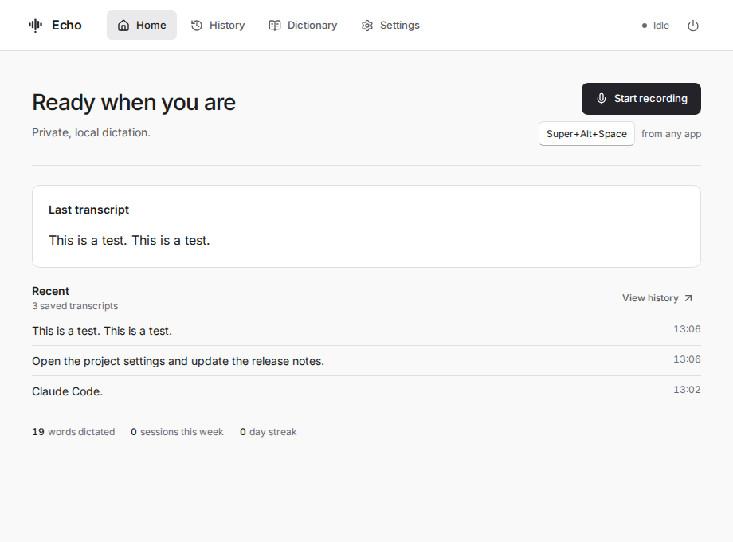
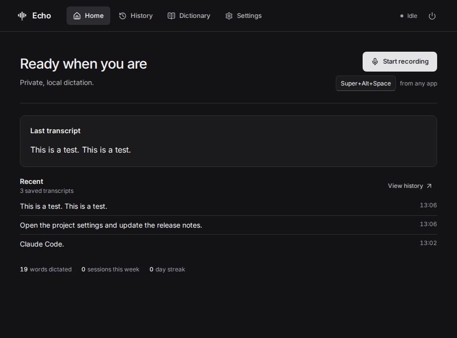
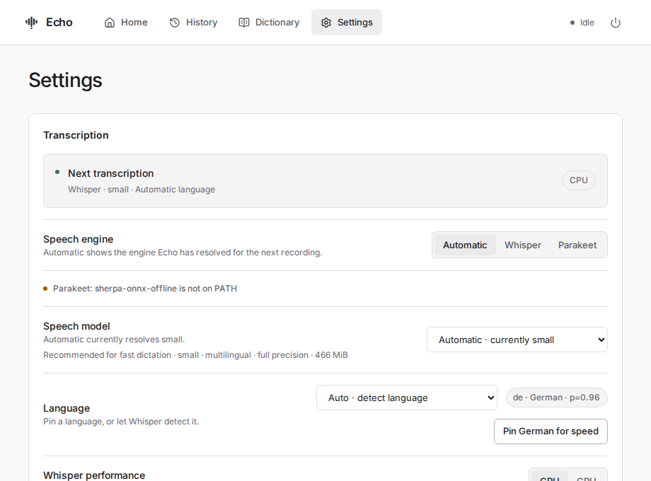
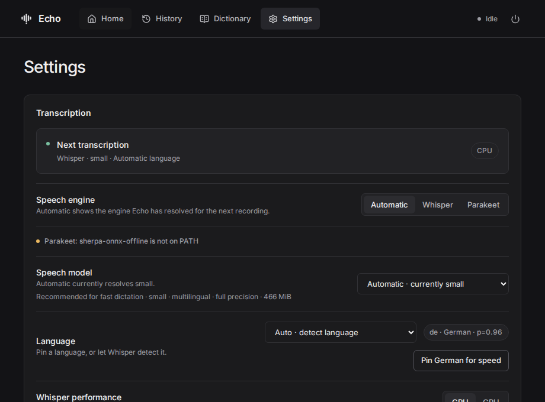

# Echo 1.0 frontend

Echo uses a full-width workspace with labeled navigation and a text recording button. The latest transcript sits above recent history and compact usage counts. Neutral light and dark themes share the same controls and spacing.

Page headings use 28px Inter, section headings use 14px, controls use 13px, and secondary text uses 12px. The transcript uses 16px for reading. Spoken dictionary phrases use the same proportional font as the rest of the interface. Icon buttons center their glyphs without inherited text-button padding.

Horizontal navigation preserves content width at the 920 × 680 default window and 760 × 560 minimum. Home places recording beside its heading on desktop and below it on narrow screens. Responsive styles load after component styles so narrow layouts take precedence. Existing controllers and generated IPC types still own application state.









## Reproduce the screenshots

The browser preview uses disposable fixtures, not real audio or local transcripts. These Home screenshots represent completed shortcut verification. The capture command also saves setup, recording, History, Dictionary, and Settings at four widths in both themes.

Start the preview in one terminal:

```sh
npm run dev --prefix frontend -- --host 127.0.0.1 --port 4178
```

Run the capture in another terminal from the repository root:

```sh
node frontend/scripts/capture-design.mjs
```

Images are written to `frontend/test-results/design`. Pass a destination as the first argument to choose another directory.

## Verify interactions

```sh
./scripts/verify-settings-ux.sh
npm run build --prefix frontend
npm run lint --prefix frontend
npm run test --prefix frontend
```

The browser suite checks navigation at 390, 680, 681, 760, 920, and 1280 pixels, keyboard recording, processing controls, search, dictionary edits and long phrases, dialog focus, reduced motion, secondary-text contrast, icon alignment, consistent typography, and narrow Home layout. The existing Settings suite also checks breakpoint edges, microphone controls, theme selection, and long diagnostics.

Browser verification covers the React interface with the preview API. Native microphone capture, global shortcuts, text insertion, and Linux packaging remain covered by the repository's native tests and release workflows.
